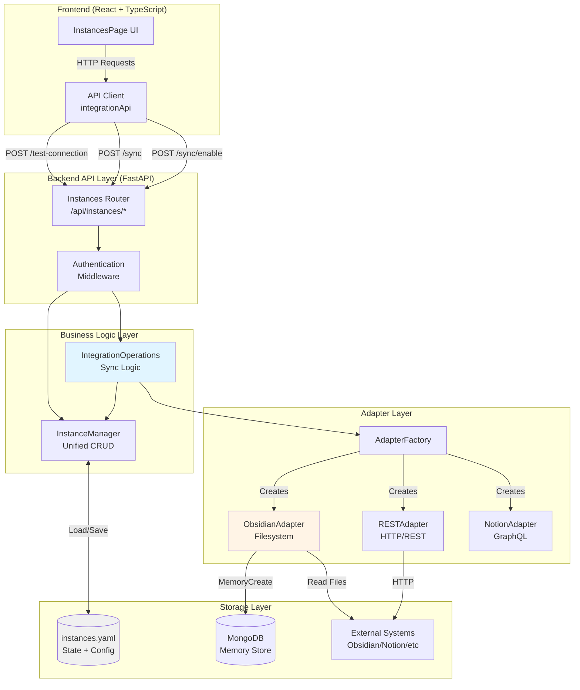
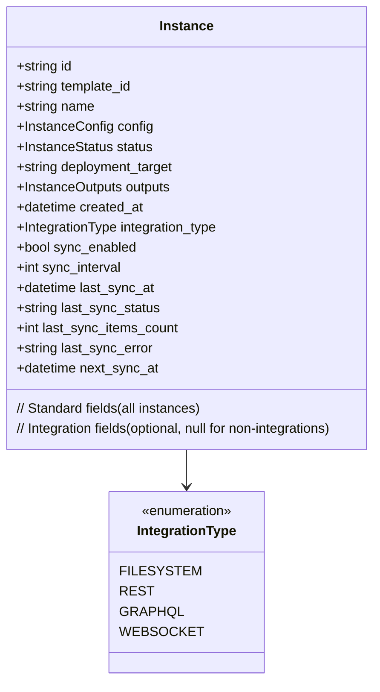
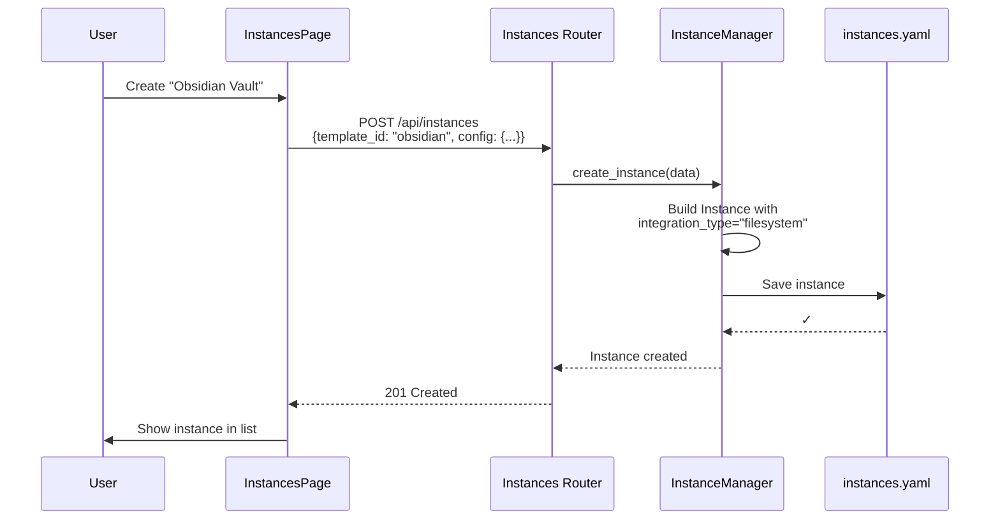
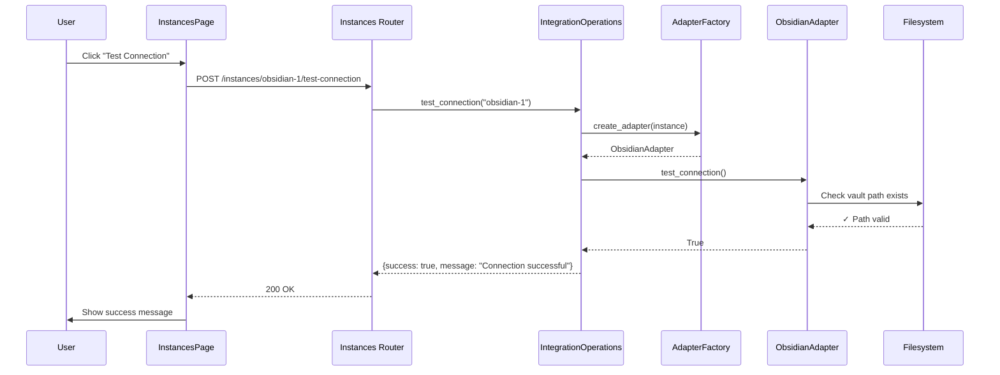
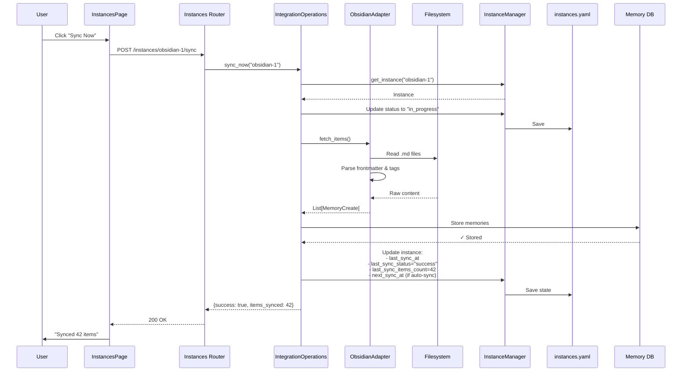
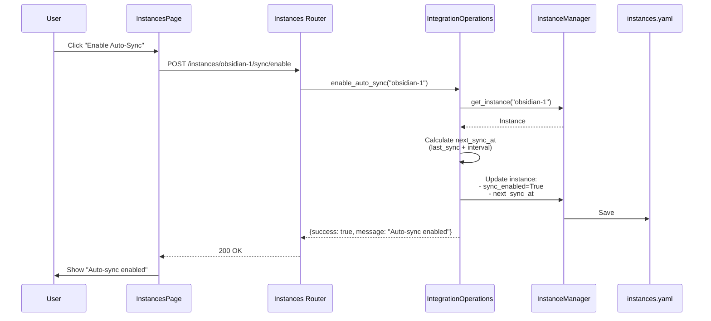
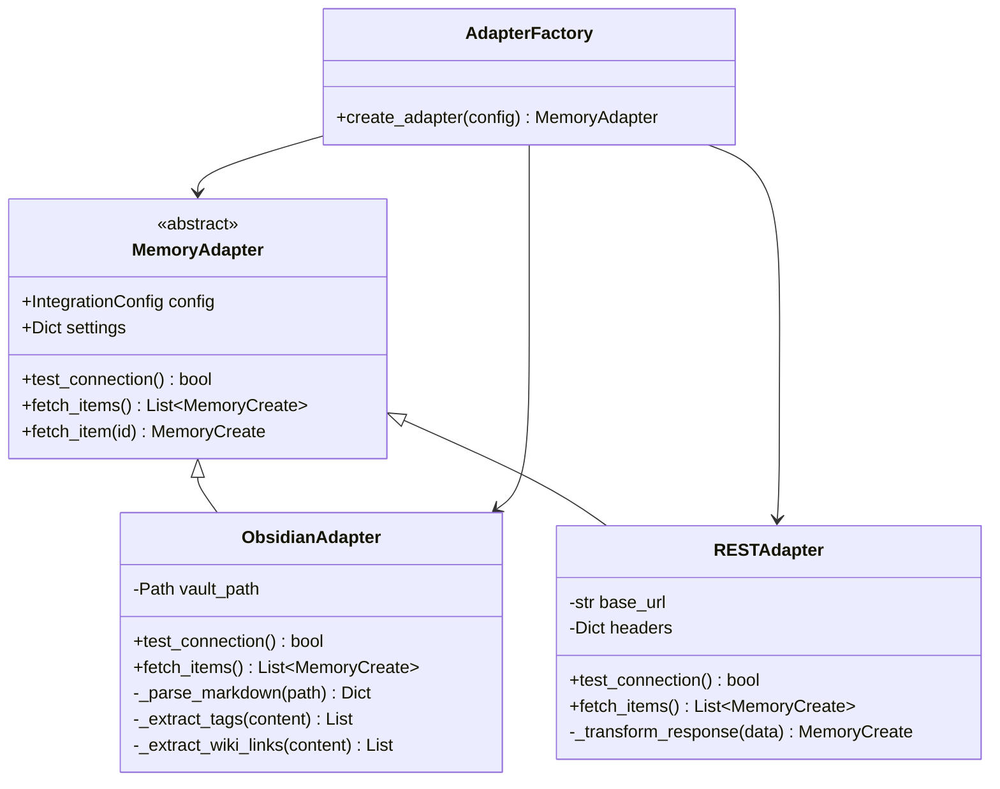
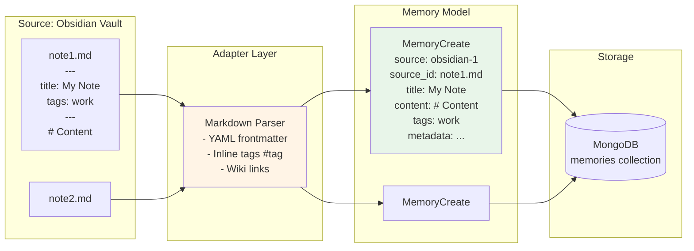
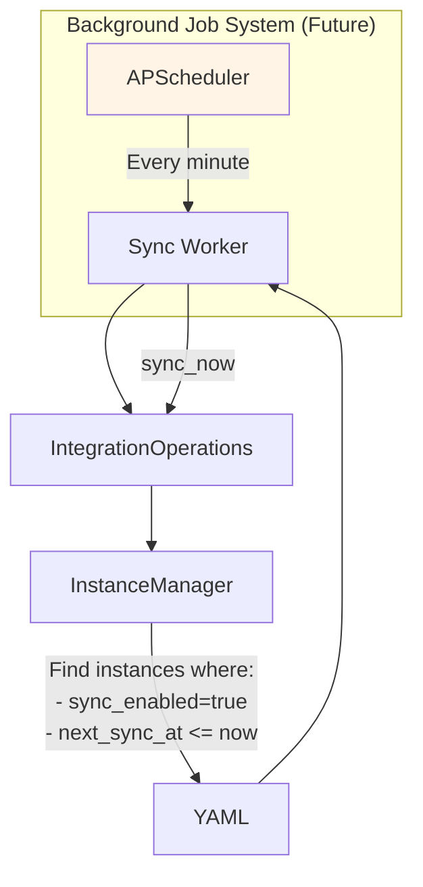

# Integration Architecture

## Overview

Integrations are instances with additional sync capabilities. They reuse 100% of the instance/wiring infrastructure and add sync-specific operations through the `IntegrationOperations` service.

## High-Level Architecture



## Unified Instance Model



**Key Insight**: Integration fields are optional. An instance is an integration if `integration_type` is not null.

## Component Interactions

### 1. Creating an Integration Instance



### 2. Testing Connection



### 3. Manual Sync Operation



### 4. Enable Auto-Sync



## Adapter Pattern



## Data Flow: Obsidian Vault → Memory Store



## Key Design Principles

### 1. Zero Duplication
```
┌─────────────────────────────────────┐
│     Instance Infrastructure         │
│  (Used by ALL instance types)       │
│                                     │
│  • InstanceManager (CRUD)           │
│  • instances.yaml (Storage)         │
│  • Wiring system                    │
│  • Templates                        │
│  • Deployment                       │
└─────────────────────────────────────┘
                 ▲
                 │ Reused 100%
                 │
┌─────────────────────────────────────┐
│  Integration Extensions             │
│  (Only for integrations)            │
│                                     │
│  • IntegrationOperations service    │
│  • Adapter pattern                  │
│  • Sync state tracking              │
│  • API endpoints for sync           │
└─────────────────────────────────────┘
```

### 2. Extension Pattern

```
Regular Instance:
{
  "id": "chronicle-1",
  "template_id": "chronicle",
  "status": "running",
  "integration_type": null  ← Not an integration
}

Integration Instance:
{
  "id": "obsidian-1",
  "template_id": "obsidian",
  "status": "n/a",
  "integration_type": "filesystem",  ← IS an integration
  "sync_enabled": true,
  "last_sync_at": "2024-01-09T10:30:00Z",
  "last_sync_status": "success",
  "last_sync_items_count": 42
}
```

### 3. Conditional UI

```typescript
// InstancesPage.tsx - Same component for ALL instances
{expandedInstances.has(instance.id) && details && (
  <>
    {/* Configuration (shown for ALL instances) */}
    <ConfigSection />

    {/* Integration Sync UI (conditional - only for integrations) */}
    {details.integration_type && (
      <IntegrationSyncSection />  ← Only appears if integration_type exists
    )}

    {/* Access URL (shown for ALL instances) */}
    <AccessURLSection />
  </>
)}
```

## File Organization

```
ushadow/
├── backend/src/
│   ├── models/
│   │   ├── instance.py              # Unified Instance model (with optional integration fields)
│   │   └── integration.py           # IntegrationType enum, IntegrationConfig
│   ├── services/
│   │   ├── instance_manager.py      # CRUD for ALL instances
│   │   └── integration_operations.py # Sync logic for integrations ONLY
│   ├── routers/
│   │   └── instances.py             # API endpoints (instance + integration routes)
│   └── memory/adapters/
│       ├── base.py                  # Abstract MemoryAdapter
│       ├── factory.py               # AdapterFactory (type → adapter mapping)
│       └── obsidian_adapter.py      # Obsidian-specific implementation
│
├── frontend/src/
│   ├── services/
│   │   └── api.ts                   # API client (instancesApi + integrationApi)
│   └── pages/
│       └── InstancesPage.tsx        # Unified UI (conditional sync section)
│
└── config/
    ├── instances.yaml               # Single source of truth for ALL instances
    └── providers/integrations/
        └── obsidian.yaml            # Integration template definition
```

## Future: Scheduled Sync (Phase 4)



## Comparison: Regular Service vs Integration

| Aspect | Regular Service (Chronicle) | Integration (Obsidian) |
|--------|---------------------------|----------------------|
| **Instance Type** | Docker container | Filesystem/API integration |
| **Status** | running/stopped | n/a (cloud/external) |
| **Operations** | Deploy/Undeploy | Test Connection/Sync |
| **State Tracking** | Container ID, deployment status | Sync status, last sync time |
| **UI Controls** | Start/Stop buttons | Test/Sync/Auto-Sync buttons |
| **Storage** | instances.yaml | instances.yaml (same file!) |
| **CRUD** | InstanceManager | InstanceManager (same service!) |

## Summary

**Core Architecture Insight**: Integrations are NOT a parallel system. They are instances with:
1. An optional discriminator field (`integration_type`)
2. Additional state fields for sync tracking
3. An extension service (`IntegrationOperations`) for sync logic
4. Type-specific adapters for data transformation

This design achieves **zero code duplication** while providing full integration capabilities.
